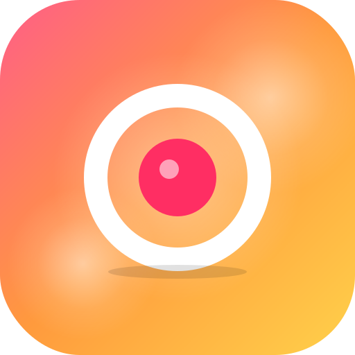

<div align="center">



# Coffigo ☕

여러 명이 손가락을 올리면 카운트다운 후 한 명을 랜덤으로 뽑아주는 안드로이드 결정 게임.<br/>
술자리 / 모임에서 "오늘 누가 사?", "심부름 누가 갈래?" 같은 거 정할 때 쓰세요.


*4가지 테마: POP · NEON · AURORA · KAWAII*

</div>

## 기능

- **멀티터치** — 손가락 수만큼 회전하는 링이 표시됨
- **자동 카운트다운** — 2명 이상 손가락이 올라가면 ~2.8초 후 추첨
- **당첨 연출** — 극적인 줌인 + 컨페티 + Web Audio 사운드 + 진동
- **4가지 테마** (POP / NEON / AURORA / KAWAII) — 우상단 ⚙ 에서 전환
- **풀스크린 + Wake Lock** — 화면 안 꺼짐
- **오프라인 지원** — 한 번 열면 인터넷 없이도 동작

## 어떻게 만들어졌나?

PWA + Capacitor 조합. HTML/JavaScript/React 로 작성 → Capacitor로 안드로이드 WebView APK 패키징.

## 다운로드

[**Releases**](../../releases) 에서 최신 APK 다운로드.

## 설치 방법

1. APK를 폰으로 옮기기 (카톡 "나에게 보내기" / 드라이브 / USB 등)
2. **설정 → 보안 → 출처를 알 수 없는 앱** 허용
3. APK 탭 → 설치

## 직접 빌드하기

```bash
git clone https://github.com/shchun/coffigo.git
cd coffigo
npm install
npx cap sync
npx cap open android
```

Android Studio에서 **Build → Build APK(s)** → `android/app/build/outputs/apk/debug/app-debug.apk` 생성.

자세한 빌드 가이드는 [`app/README.md`](./app/README.md) 참고.

## 폴더 구성

```
.
├─ app/                  PWA 소스 (HTML/JS, 매니페스트, 서비스 워커, 아이콘)
├─ android/              Capacitor가 생성한 Android 프로젝트
├─ screenshots/          README 이미지
├─ capacitor.config.json Capacitor 설정
└─ package.json
```

## 라이선스

MIT
